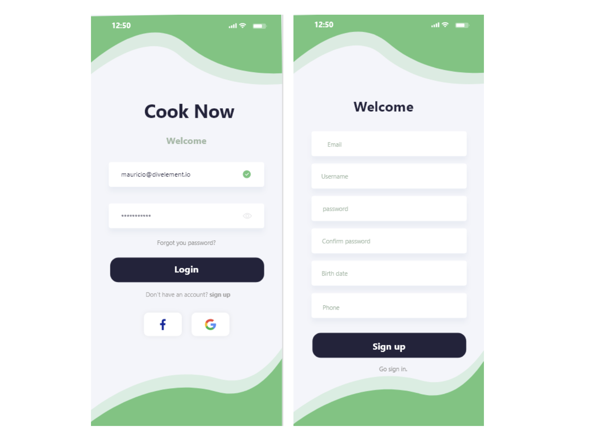
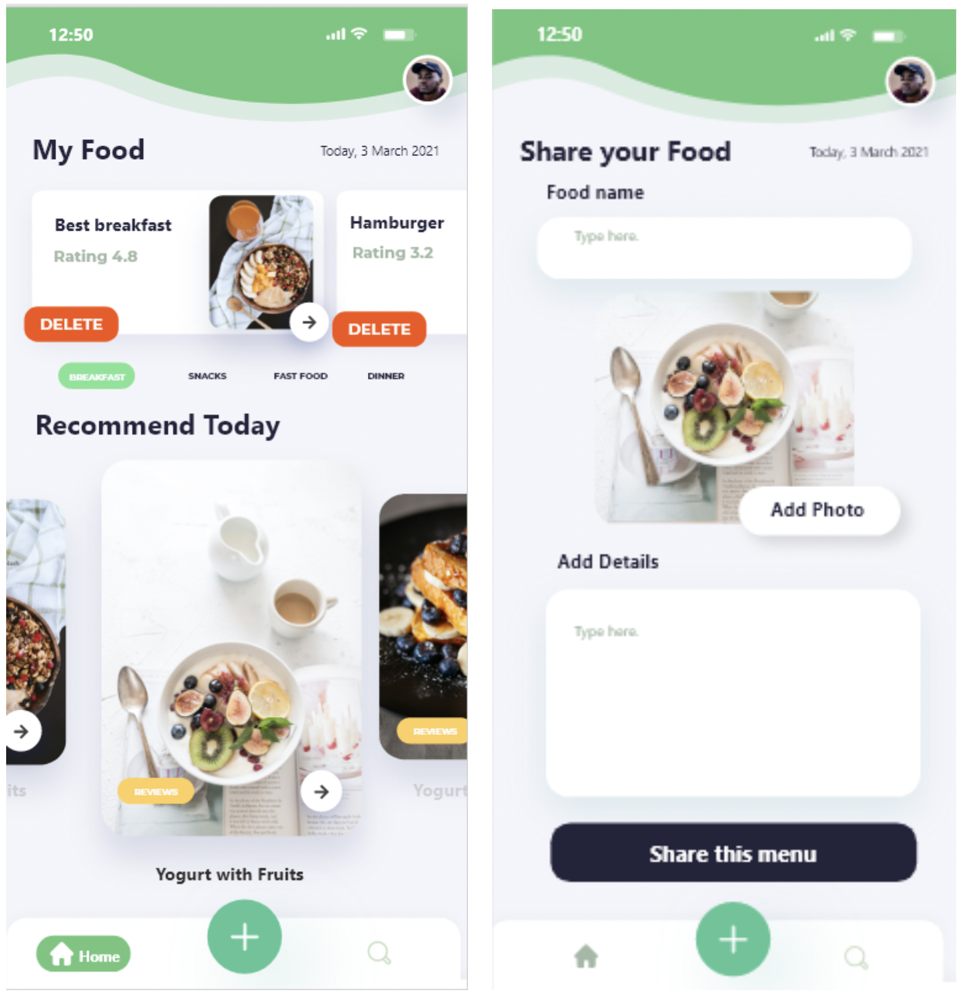
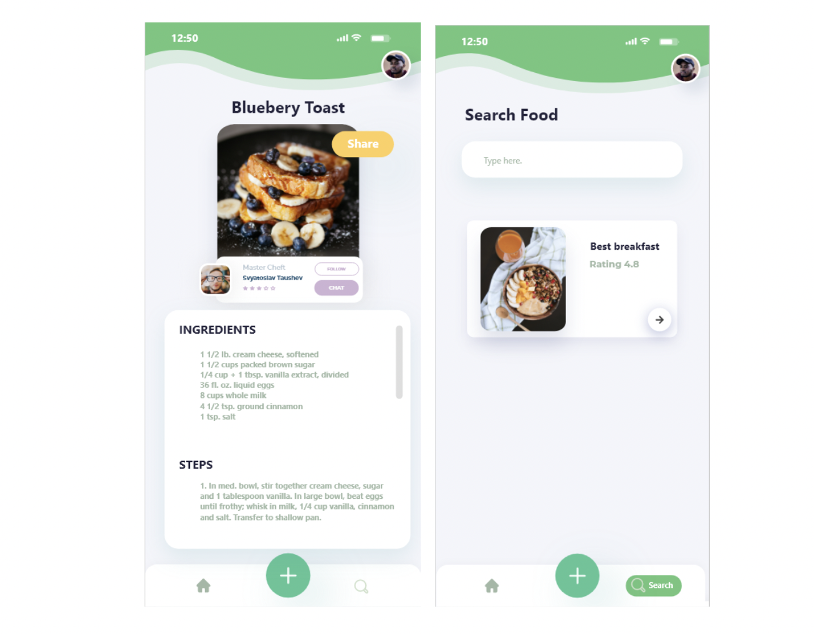
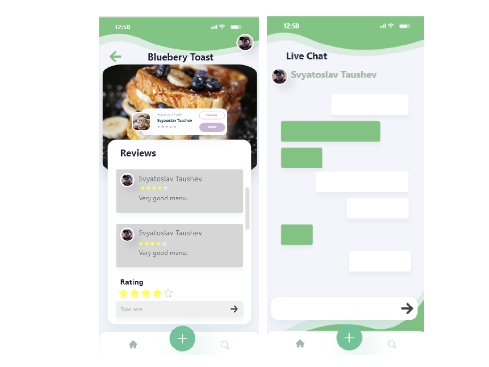
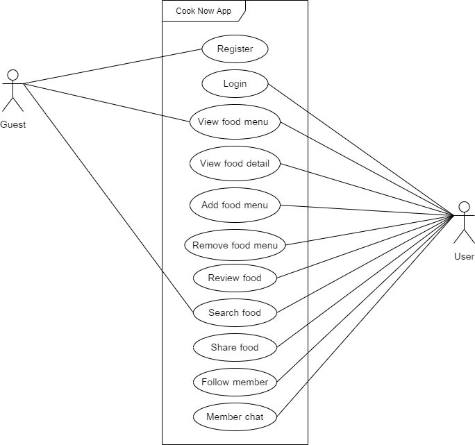
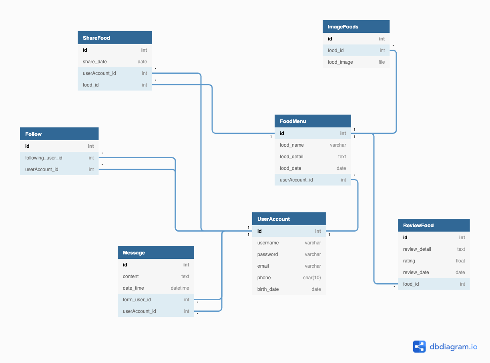
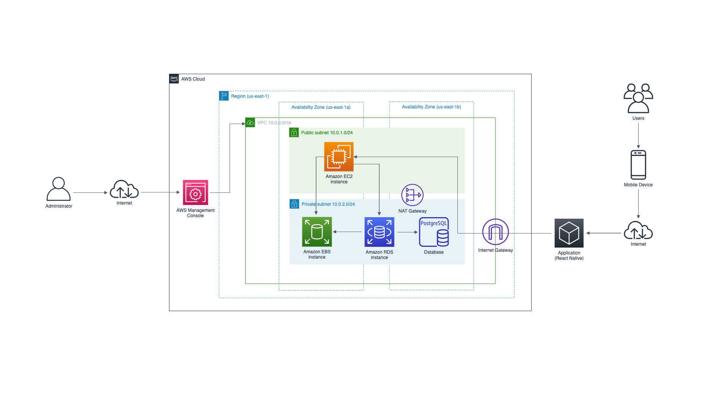

# Cook Now Application for Cloud Computing

ในยุคปัจจุบันหรือในยุคที่มีโรคระบาด Covid-19 อยู่นั้น ในการออกไปซื้ออาหารเพื่อบริโภค อาจจะมีความเสี่ยงต่อการติดโรค เพราะเหตุนั้นเองทางกลุ่มของเราเล็งเหตุถึงปัญหาเรื่องนี้ จึงอยากให้หันมาทำอาหารรับประทานเองที่บ้านของตนเองและเป็นการรับประทานอาหารที่ทำสดใหม่อยู่เสมอ สามารถรับรองความสะอาดได้ด้วยตัวเอง ซึ่งในการทำอาหารกินเองที่บ้านส่วนมากจะทำอาหารที่จำเจและทำแต่เมนูแบบเดิม ๆ กลุ่มของเราจึงคิดที่จะจัดทำแอพพลิเคชั่นนี้ขึ้นมาเพื่อตอบโจทย์ในเรื่องของการหาสูตรหรือขั้นตอนในการทำอาหารที่ตนเองอยากทำและมีความหลากหลายของเมนูอาหาร สามารถที่จะทำตอนไหนเมื่อไหร่ก็ได้ นอกจากนี้ยังสามารถแชร์เมนูอาหารที่เราทำให้ผู้อื่นได้เห็นและทำกินตามขั้นตอนได้ง่ายและสะดวกมากยิ่งขึ้น

## Use Case Diagram

## Logical Design (Database)

## AWS Architecture Diagram

